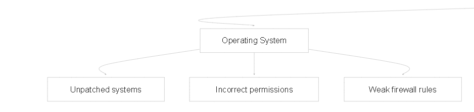
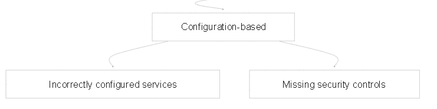
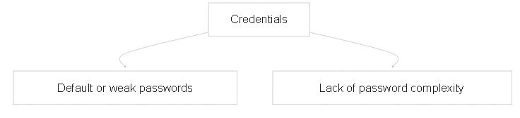
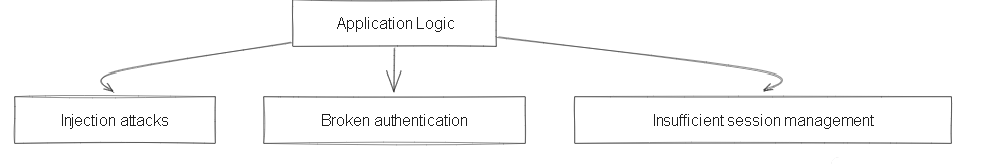
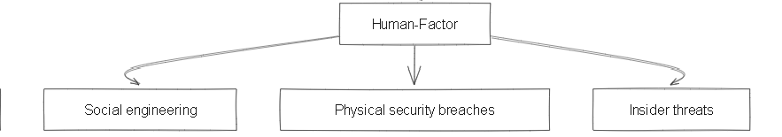
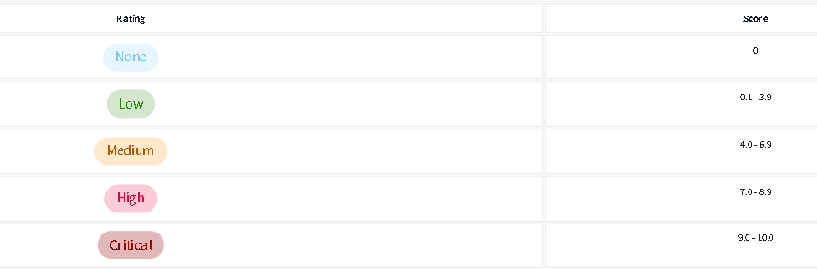
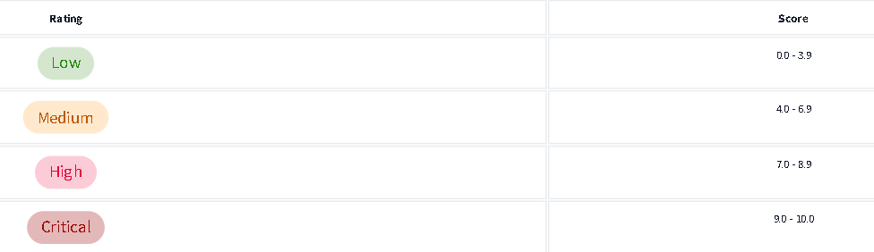
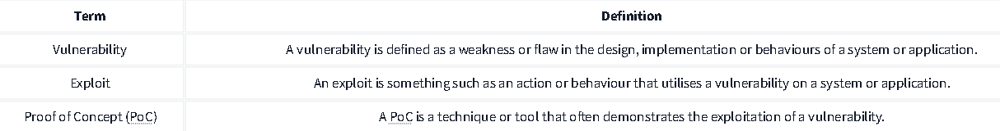

# Penetration Test Notes

TryHackMe : Vulnerability Research

August , 2024

**Vulnerability**

**Operating System**

**Configuration-based**

**Credentials**

**Application Logic**

**Human-Factor**

**Common Vulnerability Scoring System**  
Determined by some of the following factors (but many more):

  1\. How easy is it to exploit the vulnerability?

  2\. Do exploits exist for this?

  3\. How does this vulnerability interfere with the  
 CIA(Confidentiality, Integrity, and Availability) triad?

**Vulnerability Priority Rating (VPR)**  
Unlike CVSS, VPR scoring takes into account the relevancy of a vulnerability.  

There are resources on the internet that keep track of vulnerabilities for all sorts of software, operating systems and more\! This room will showcase two databases that we can use to look up existing vulnerabilities for applications discovered in our infosec journey, specifically the following websites:

1\. [NVD (National Vulnerability Database)](https://nvd.nist.gov/vuln)

2\. [Exploit-DB](http://exploit-db.com/)

Fundamental key terms :   

## NVD – National Vulnerability Database

The National Vulnerability Database is a website that lists all publically categorised vulnerabilities. In cybersecurity, 

vulnerabilities are classified under “**C**ommon **V**ulnerabilities and **E**xposures” (Or CVE for short).

These CVEs have the formatting of CVE\-YEAR-IDNUMBER.

**Automated Vs. Manual Vulnerability Research**

Vulnerability research is a critical component of cybersecurity. It involves identifying and analyzing weaknesses in systems, applications, and networks that could be exploited by malicious actors. This process can be carried out manually or with the aid of automated tools.

### **Manual Vulnerability Research**

Manual research is a traditional approach that involves security experts using their knowledge and skills to identify vulnerabilities. This method often includes:

* **Penetration testing:** Simulating attacks to discover vulnerabilities and assess the impact of potential breaches.  
* **Code review:** Inspecting source code for security flaws, such as buffer overflows, SQL injection, and cross-site scripting (XSS).  
* **Network scanning:** Using tools to identify open ports, services, and vulnerabilities in networks.

**Advantages of manual research:**

* **Customization:** Can be tailored to specific systems and environments.  
* **In-depth analysis:** Allows for a deeper understanding of vulnerabilities and their potential impact.  
* **Creativity:** Can identify vulnerabilities that automated tools might miss.

**Disadvantages of manual research:**

* **Time-consuming:** Can be slow and labor-intensive.  
* **Error-prone:** Human error can lead to missed vulnerabilities.  
* **Limited scope:** May not cover all potential vulnerabilities.

### **Automated Vulnerability Research**

Automated tools can significantly accelerate the vulnerability research process by automating tasks such as scanning, analysis, and reporting. These tools often use techniques like:

* **Vulnerability scanning:** Identifying known vulnerabilities by comparing systems against databases of vulnerabilities.  
* **Web application testing:** Scanning web applications for common vulnerabilities like SQL injection and XSS.  
* **Network mapping:** Creating a visual representation of a network to identify potential security risks.

**Advantages of automated research:**

* **Speed:** Can quickly scan large systems and networks.  
* **Efficiency:** Reduces the need for manual labor.  
* **Consistency:** Provides consistent results and reduces the risk of human error.  
* **Scalability:** Can handle large-scale environments.

**Disadvantages of automated research:**

* **False positives:** May identify vulnerabilities that are not actually exploitable.  
* **Limited depth:** May not provide a deep understanding of vulnerabilities.  
* **Cost:** Can be expensive for advanced tools.

### **Combining Manual and Automated Approaches**

The most effective vulnerability research often involves a combination of manual and automated methods. Manual research can be used to identify vulnerabilities that automated tools might miss, while automated tools can be used to efficiently scan large systems and networks. By combining these approaches, organizations can achieve a more comprehensive and effective vulnerability assessment.

In conclusion, both manual and automated vulnerability research have their own strengths and weaknesses. The best approach for an organization will depend on its specific needs, resources, and risk tolerance. By carefully considering the advantages and disadvantages of each method, organizations can choose the most appropriate approach to protect their systems and data.

**Finding Manual Exploits**

**Rapid7**  
Much like other services such as Exploit DB and NVD, Rapid7 is a vulnerability research database. The only difference being that this database also acts as an exploit database. Using this service, you can filter by type of vulnerability (I.e. application and operating system).

Additionally, the database contains instructions for exploiting applications using the popular Metasploit tool (you will learn about this tool in-depth later in the learning path). For example, this entry on [Rapid7](https://www.rapid7.com/db/) is for “[Wordpress Plugin SP Project & Document](https://www.rapid7.com/db/modules/exploit/multi/http/wp_plugin_sp_project_document_rce/)”, where we can see instructions on how to use an exploit module to abuse this vulnerability.

**GitHub**

GitHub is extremely useful in finding rare or fresh exploits because anyone can create an account and upload – there is no formal verification process like there is with alternative exploit databases. With that said, there is also a downside in that PoC’s may not work where little to no support will be provided.

GitHub uses a tagging and keyword system, meaning that we can search GitHub by keywords such as “PoC”, “vulnerability”, and many more. At the time of writing, there are 9,682 repositories with the keyword “cve”. We are also able to filter the results by programming language.

**Searchsploit**

Searchsploit is a tool that is available on popular pentesting distributions such as Kali Linux. It is also available on the TryHackMe AttackBox. This tool is an offline copy of Exploit-DB, containing copies of exploits on your system. 